# Naveena's Store

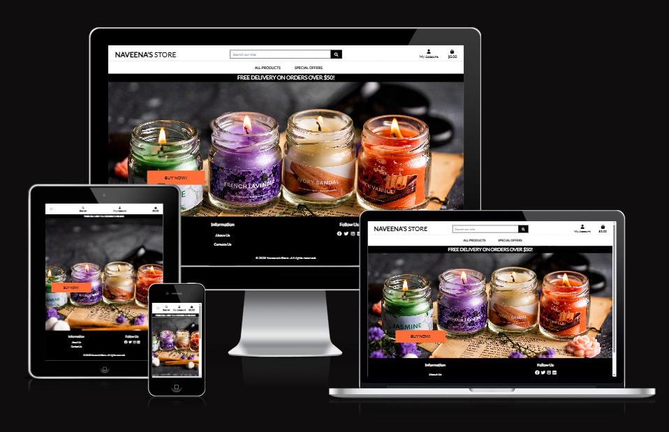

## Description

Welcome to Naveena's Store, your one-stop destination for premium, handmade scented candles and reed diffusers. We specialize in creating products infused with natural essences, designed to enhance your home with delightful fragrances. Although we’re a new and growing brand in the candle and diffuser market, we are committed to offering high-quality, eco-friendly products that bring warmth, relaxation, and a touch of elegance to any space.

This project was developed as part of Code Institute's Full Stack Software Developer program.

#### - By Priyanka Dhanabal

The live version of the project can be viewed [here](https://naveenas-store-a7c4968621d6.herokuapp.com/)

You can check out my Repository [here](https://github.com/Priyanka-Dhanabal/Naveena_store_PP5)

## Table of contents

1. [Project Research and Preparation](#project-research-and-preparation)
   1.1. [Naveena's Store User Stories](#naveenas-store-user-stories)  
   1.2. [EPICS](#epics)  
   1.3. [Admin and Developer Goals](#admin-and-developer-goals)  
   1.4. [First-Time Visitor Goals](#first-time-visitor-goals)  
   1.5. [Returning Visitor Goals](#returning-visitor-goals)  
   1.6. [Landing Page on Desktop](#landing-page-on-desktop)  
   1.7. [Landing Page on Mobile](#landing-page-on-mobile)  
   1.8. [E-Commerce Business Model](#e-commerce-business-model)  
   1.9. [Marketing Strategies](#marketing-strategies)  
   1.10. [Entity Relationship Diagram](#entity-relationship-diagram)  
   1.11. [Wireframes](#wireframes)

2. [Features](#features)

3. [Future Features](#future-features)

4. [Known Bugs](#known-bugs)

5. [Technologies Used](#technologies-used)
   5.1. [Dependencies](#dependencies)

6. [Deployment](#deployment)
   6.1. [Clone GitHub Repository](#clone-github-repository)  
   6.2. [Deployment on Heroku](#deployment-on-heroku)  
   6.3. [Amazon AWS S3](#amazon-aws-s3)

7. [Credits](#credits)

## Project Research and Preparation

For the development of this project, I adopted **Agile development** methodologies to ensure a flexible and iterative approach.

To manage and track the progress of user stories during the project, I created a Kanban Board board. The board was divided into four columns: **Epics**, **To Do**, **In Progress**, and **Done**.

- Epics: This column contained overarching goals that grouped related user stories together.
- To Do: At the start of each iteration, user stories to be completed were moved here.
- In Progress: As work began on a user story, it was moved to this column.
- Done: Completed user stories were moved to this column to indicate they were finished.

This setup provided a clear and simple way to track the status of tasks throughout the project, ensuring that progress was organised and transparent.

### Naveena's Store User Stories

### EPICS

User stories are short, simple descriptions of a feature or functionality told from the perspective of the end user. They help ensure the development process remains user-focused, aligning each task with specific user needs and goals. Below are the user stories I created for my project:

### Admin and Developer Goals

- As an admin, I can assign products to specific categories so that users can find them more easily during browsing.
- As an admin, I can upload, update, or delete product images so that products are visually appealing and well-represented.
- As an admin, I can edit existing product details (e.g., name, price, description, stock) so that the catalogue stays accurate and up-to-date.
- As an admin, I can add new products to the catalogue so that users can see and purchase the latest items available.
- As an admin, I can delete products from the catalogue so that unavailable items no longer appear on the site.
- As an admin, I can sort products in the admin panel by various criteria (e.g., name, price,) so that I can manage the catalogue more efficiently.
- As an admin, I can view all messages submitted by users in a structured format so that I can respond to inquiries efficiently.
- As an admin, I can process payments using Stripe so that I can handle transactions securely and reliably.

### First-Time Visitor Goals

- As a user, I can fill out a contact form on the website so that I can send inquiries or feedback to the company.
- As a user, I can see a detailed breakdown of my order total, including discounts and shipping, so that I understand the final price I am paying.
- As a user, I can receive an email confirmation after completing my order so that I know my transaction was successful.
- As a user, I can view a summary of the products in my cart so that I can confirm my order is correct before checkout.
- As a user, I can experience a clean and professional design so that I feel confident shopping on a high-quality website.
- As a user, I can access a clear and well-organised navigation menu so that I can find the information or products I need without frustration.
- As a user, I can access the website on my mobile device so that I can browse and shop seamlessly on the go.
- As a user, I can see visual or textual feedback when interacting with elements (e.g., buttons or forms) so that I know my actions have been registered.
- As a user with disabilities, I can use assistive technologies (e.g., screen readers) to navigate the site so that I can access the same features as any other user.
- As a user, I can experience minimal load times on every page so that I don't lose interest or abandon the site.
- As a user, I can access a secure checkout process so that I feel confident that my payment details are safe.

### Returning Visitor Goals
- As a returning user, I can securely save my payment details so that future purchases are faster and easier.
- As a returning user, I can review my previous purchases so that I can reorder or track my past orders.
- As a returning user, I can leave reviews for products I’ve purchased so that I can share feedback with other users.

### Landing page on desktop 

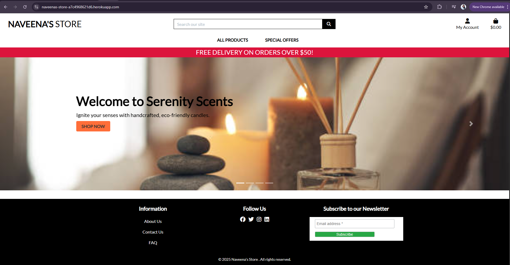

### Landing page on mobile

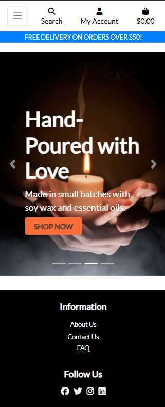

### E-Commerce Business Model

Naveena's Store operates on a B2C (Business-to-Consumer) model, offering high-quality, handmade scented candles and reed diffusers directly to our valued customers. Through our easy-to-navigate e-commerce platform, we ensure a seamless shopping experience, where individual consumers can explore, select, and purchase our products with convenience. Our focus is on providing exceptional products that enhance your home environment, all while maintaining a personal touch and commitment to customer satisfaction.

### Marketing Strategies

Search Engine Optimization (SEO)
Optimize for Relevant Keywords: Focusing on keywords related to scented candles, reed diffusers, and natural home fragrance products. Use these keywords throughout your website and blog to improve your search engine rankings and visibility.

Marketing is done on customer satisfaction where they would use word of mouth to spread the word about our products. At Fitness Fanatic a Facebook webpage was also setup to spread the word about our products that we offer [Facebook Page](readme_images/Facebook.png)

### Entity Relationship Diagram
The entity relationship diagram for this project can be seen below.

1. The profiles_userprofile model has a one-to-one relationship with the auth_user model, as each user can have only one profile.

2. The products_product model has a one-to-many (Foreign Key) relationship with the products_category model, as each product belongs to one category, but a category can have many products.

3. The products_review model has:
   - A one-to-many (Foreign Key) relationship with the auth_user model, as one user can post many reviews.
   - A one-to-many (Foreign Key) relationship with the products_product model, as one product can have many reviews.

4. The account_emailaddress model has a one-to-one relationship with the auth_user model, as each user can have one primary email address.

5. The account_emailconfirmation model has a one-to-many (Foreign Key) relationship with the account_emailaddress model, as one email address can have multiple confirmations.

6. The checkout_order model has a one-to-many (Foreign Key) relationship with the profiles_userprofile model, as one user profile can have many orders.

7. The checkout_orderlineitem model has:
   - A one-to-many (Foreign Key) relationship with the checkout_order model, as one order can have many line items.
   - A one-to-many (Foreign Key) relationship with the products_product model, as many line items can represent one product.

8. The contact_contactmessage model has a one-to-many (Foreign Key) relationship with the auth_user model, as one user can send many contact messages.

Below is the Entity Relationship Diagram (ERD) for the Maison Lavaux project, which visualises the relationships between the various models in the database.

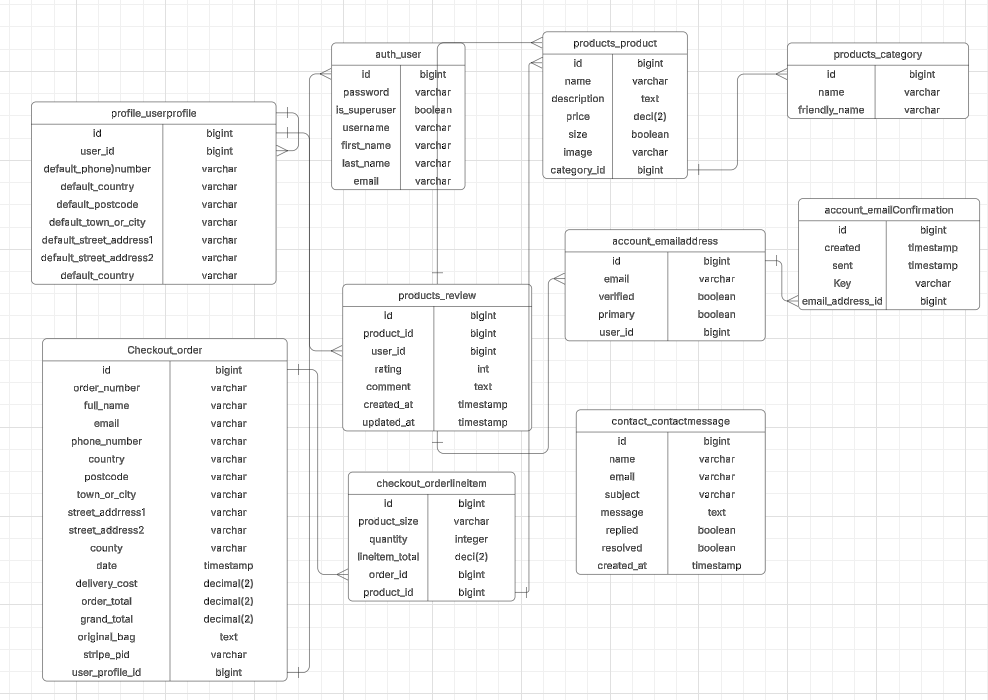

[Back to Table of Contents](#table-of-contents)

### Wireframes

All wireframes for the website were designed using the Balsamiq Desktop Application. These wireframes served as the foundation for planning the website's layout and user experience across different devices.

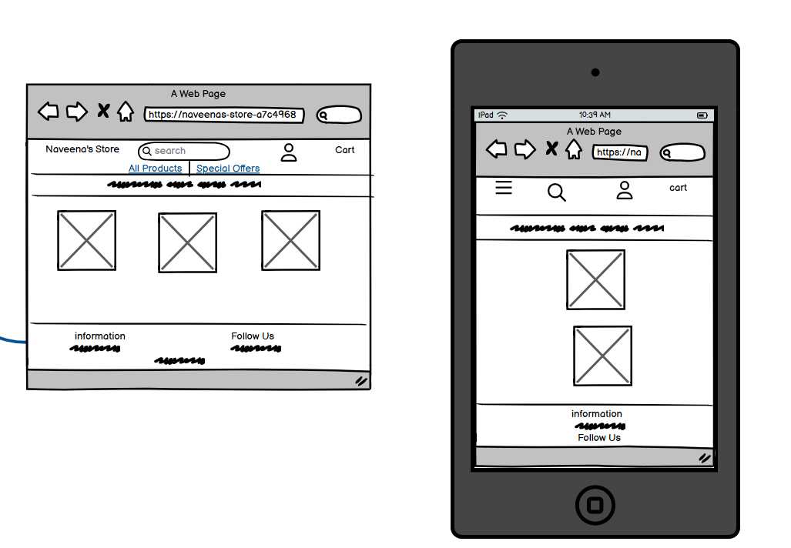

[Back to Table of Contents](#table-of-contents)

### Design

Color Palette: 
-   The color scheme is kept simple by opting mainly for a combination of Black/marroon text set against the light backgrounds and White text against the dark backgrounds.  Throughout the site, the user will see light and calming, welcoming colors like this when hovering over certain sections as well as colorful buttons on each page.

Color Scheme:
- Text: #000 / rgb(82, 0, 0)
- Body Background: Image taken from google images

Typography:
- Imported Lato from Google fonts user as the primary font, and Sans-Serif used as the secondary font.

[Goto Top](#Table of contents)

### Kanban Board

To manage and track the progress of user stories during the project, I created a Kanban Board board. The board was divided into four columns: Epics, To Do, In Progress, and Done.

Epics: This column contained overarching goals that grouped related user stories together.
To Do: At the start of each iteration, user stories to be completed were moved here.
In Progress: As work began on a user story, it was moved to this column.
Done: Completed user stories were moved to this column to indicate they were finished.
This setup provided a clear and simple way to track the status of tasks throughout the project, ensuring that progress was organised and transparent.

## Features

### Base Template file

For my project, the base.html template serves as the foundation for the overall structure and layout of the website. By centralising common elements such as the header, footer, and navigation in a single file, it ensures consistency across all pages and simplifies maintenance. This approach allows individual pages to focus on their unique content while inheriting the shared layout and functionality from the base template. From the base.html template, the following features are included on every page within the project:

#### Meta Tags
- Essential meta tags, including character encoding, viewport settings for responsiveness, and a default meta description that can be customised on individual pages.

#### CSS and JavaScript Includes
- Core CSS includes such as Bootstrap, Google Fonts, and custom styles from `base.css`.
- JavaScript libraries such as jQuery, Popper.js, Bootstrap JS, and Stripe for payment integration.
- Additional, page-specific CSS and JavaScript can be added via block tags (`corecss`, `extra_css`, `corejs`, `extra_js`).

#### Navigation Bar
- A fixed-top navbar with search functionality, user account options (login, profile, logout), and a shopping cart icon displaying the number of items in the cart.
- Dynamic greeting for logged-in users with their username or a "My Account" label for guests.
  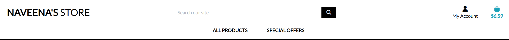
  
#### Footer with Social Media and Newsletter Signup
- The header includes the website logo, main navigation, and a delivery banner for promotions.
- The footer contains links to information pages, social media profiles, and a newsletter subscription form.

  

- External links include the rel="noopener noreferrer" attribute for the following reasons:
  - Security: Prevents security risks like tabnabbing by disabling access to the window.opener object.
  - Performance: Improves browser performance by not retaining references to the original tab.
  - Privacy: Stops the browser from sending the referring URL to the destination website.

#### Dynamic Content Blocks
- Custom content areas such as `meta`, `page_header`, and `content` are made flexible through the use of `` tags, allowing pages to easily modify or extend these areas.

#### Toast Notifications
- Displays dynamic notifications (success, error, warning, info) based on messages in the request context.

#### Dynamic Year Display
- The current year is dynamically displayed in the footer using JavaScript, ensuring the copyright information remains up-to-date.

These features ensure a consistent user experience and allow for easy customisation of content across different pages, improving the maintainability and scalability of the project.

### Home Page

The homepage of Naveena's Store is thoughtfully designed to provide an engaging and seamless user experience while showcasing our collection. Below are the standout features:

#### Products page

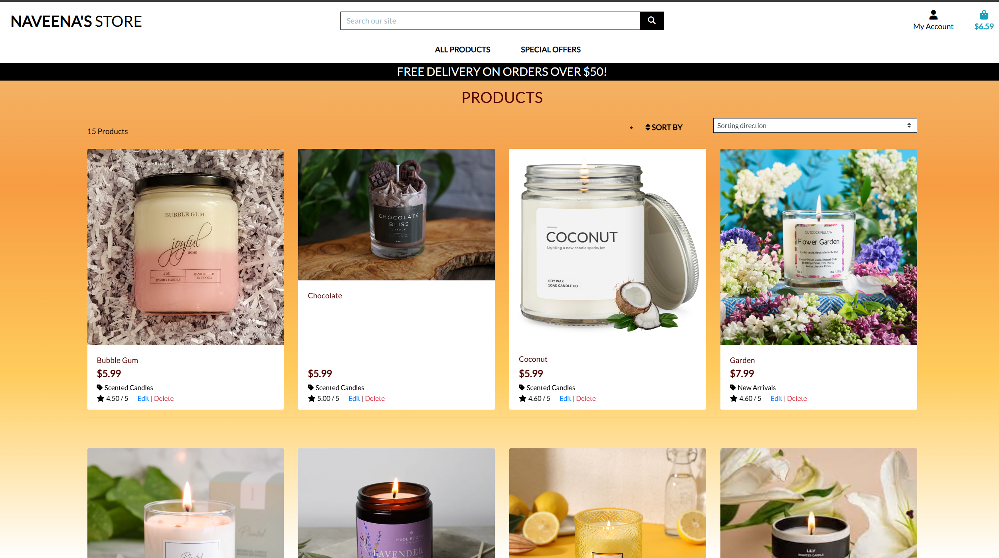

### Product Details Page
- Displays detailed product information, including:
  - Name
  - Price
  - Category
  - Description
  - Size
  - Rating
  - Product Review

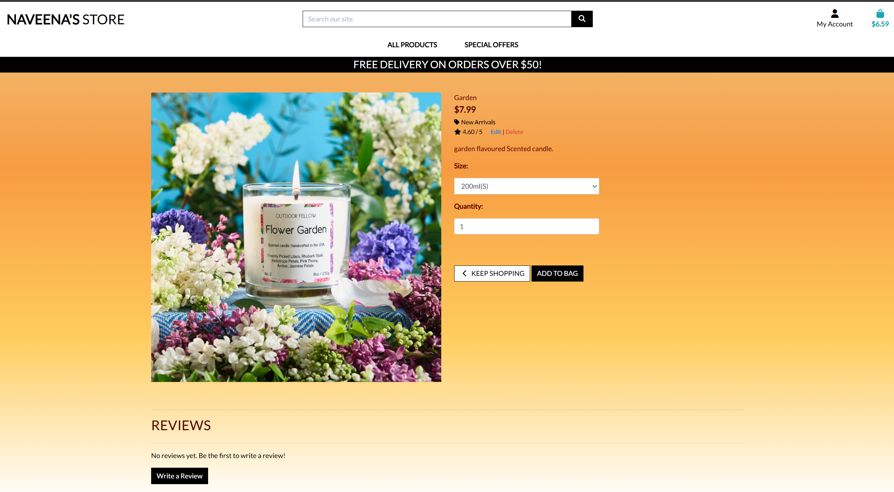

#### Image Handling

- Displays the product image if available.
- Provides a fallback "no image available" placeholder for missing images.
- Allows users to view the full-size image by clicking on it.
- Uses `alt` attributes to provide descriptive text for images, improving accessibility for screen readers and enhancing the user experience for visually impaired users.

#### Add to Bag Functionality
- Users can select the desired quantity using:
  - Increment and decrement buttons.
  - Direct input (supports quantities between 1 and 99).
- Ensures a smooth shopping experience by redirecting users back to the product page after adding to the bag.

#### Superuser Capabilities
- Superusers have access to additional controls, such as:
  - Edit button to update product details.
  - Delete button with a modal confirmation to prevent accidental actions. This feature addresses a limitation in the Boutique Ado project, which lacked a confirmation step for deletions.

#### Product Review

The product review functionality is an integral part of the application, enabling users to provide feedback on products, rate their quality, and share their experiences with other potential buyers. Below is an explanation of how the feature works and why it is a significant improvement over the Boutique Ado project.

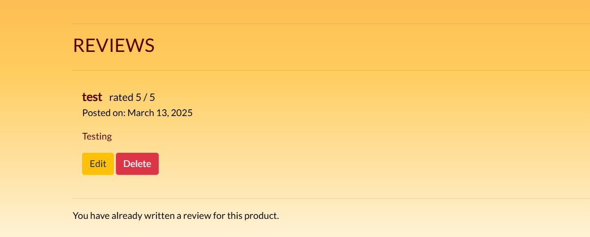

##### How the Product Review Feature Works

1. Dynamic Rating Update
   - The product's average rating dynamically updates whenever a new review is added or edited. This ensures that the displayed rating always reflects the latest user feedback.

2. Adding a Review
   - Authenticated users can submit a review for a product by filling in a form that includes a star rating and a comment.
   - The system checks if the user has already reviewed the product. If a review exists, they are notified that only one review per user is allowed.

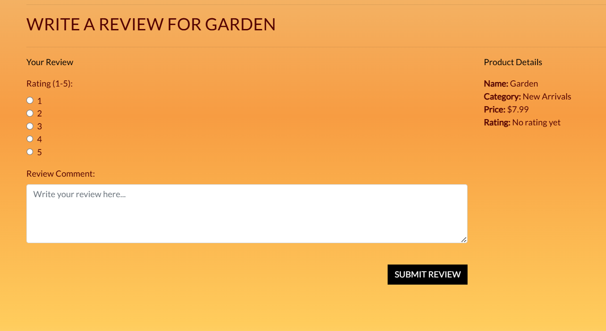

3. Editing a Review
   - Users can edit their existing reviews. The form pre-fills with the user's current review details, allowing for easy updates, and any changes are saved back to the database.

4. Deleting a Review
   - Users can delete their reviews if they no longer wish to share their feedback. The review is permanently removed from the database upon confirmation.

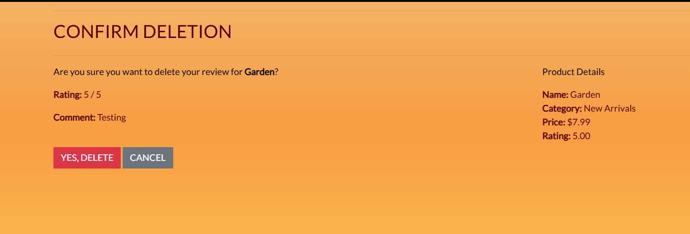

5. Authentication Requirement
   - Only logged-in users can add, edit, or delete reviews. Unauthenticated users are prompted to log in, with their current page preserved as the redirect URL for a seamless experience.

6. Visibility on Product Pages
   - All reviews for a product are displayed on its detail page, showing:
     - Star rating
     - Review text
     - Date of posting
     - Reviewer's username

7. Review Management by Superusers
   - While reviews are primarily user-driven, superusers retain full administrative control over product-related data, ensuring data integrity and quality.


##### Why This Feature is Useful

1. Encourages Customer Engagement
   - The review feature provides a platform for users to share their opinions, fostering a sense of community and encouraging trust among customers.

2. Improves Product Transparency
   - With dynamic ratings and visible reviews, customers can make informed purchasing decisions based on real feedback from others.

3. Prevents Spam or Redundant Reviews
   - By restricting one review per user per product, the system avoids clutter and ensures that feedback remains meaningful and relevant.

4. Facilitates Easy Review Management
   - The ability to edit and delete reviews gives users full control over their feedback, reducing frustration and enhancing user satisfaction.

The Boutique Ado project did not include a review system, which limited customer engagement and product transparency. Without reviews or dynamic ratings, users were unable to provide feedback or view others' opinions. The addition of the product review feature in this project addresses these shortcomings, creating a more interactive and user-friendly shopping experience.

#### Backend Features

1. Add to Bag Functionality
   - Users can add products to their shopping bag, with options to select quantity and size (if applicable).
   - Stock availability is validated to ensure users cannot add more than the available quantity.

2. Adjust Bag Functionality
   - Allows users to update the quantity of items in the bag.
   - Validates stock availability during adjustments to prevent exceeding the available stock.
   - Dynamically updates the bag contents and session data.

3. Remove from Bag Functionality
   - Provides the ability to remove items from the shopping bag.
   - Handles both size-specific items and general products.
   - Returns appropriate responses for success or failure.

4. Session-Based Bag Storage
   - Stores the shopping bag in the user's session, ensuring persistence across pages.
   - Handles size-specific quantities within the session data structure.

5. Error Handling
   - Displays error messages if users attempt to add or adjust quantities exceeding the available stock.
   - Uses the `messages` framework for clear feedback on user actions (e.g., updates, removals, or errors).

#### Frontend Features

1. Responsive Design
   - Fully responsive layout optimized for both mobile and desktop users.
   - Mobile view displays individual product details and totals, while the desktop view uses a table format for better readability.

2. Product Details
   - Displays product images, names, sizes (if applicable), prices, quantities, and subtotals in an organized manner.
   - Subtotals and total costs are dynamically calculated and displayed.

3. Interactive Quantity Adjustment
   - Users can increment or decrement product quantities directly in the bag.
   - Real-time validation and updates ensure accurate totals.

4. Empty Bag Handling
   - If the shopping bag is empty, a message is displayed to the user.
   - Includes a "Keep Shopping" button to redirect users back to the product catalog.

5. Checkout Integration
   - Clearly displays bag totals and provides checkout buttons for easy navigation to the checkout process.

6. Reusable Templates
   - Modular templates for product details, totals, and checkout buttons allow for consistent styling and easier maintenance.

7. User Feedback
   - Success and error messages inform users of updates, stock limitations, and removals, improving the overall user experience.

8. Back to Top Button
   - A floating "Back to Top" button improves navigation, especially for mobile users with long bag content.

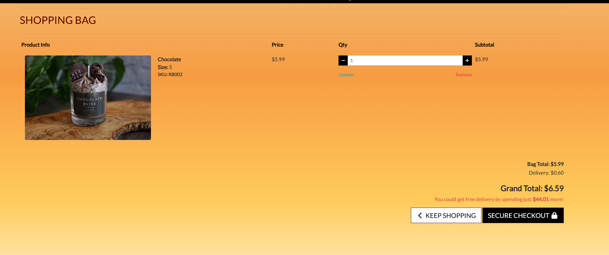

### Checkout Page / Checkout Success 

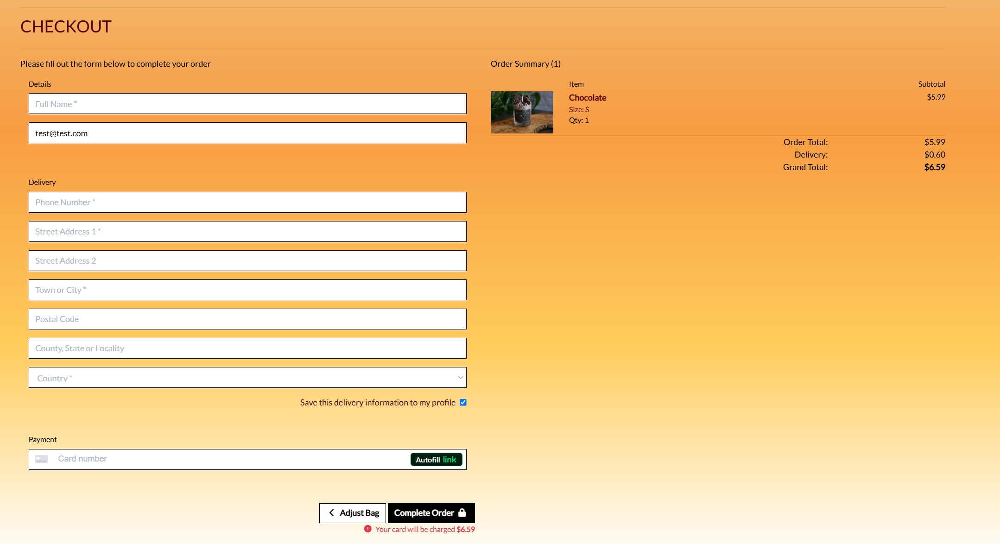

#### Backend Features

1. Checkout form validation
   - Validates all form fields, including full name, email, address, and payment details.
   - Ensures data is correctly formatted and required fields are filled.

2. Session-based bag integration
   - Retrieves bag contents from the session to process orders seamlessly.
   - Validates that the bag is not empty before proceeding with the checkout.

3. Stripe payment integration
   - Uses Stripe's PaymentIntent to securely process payments.
   - Creates a PaymentIntent during checkout and uses client and server-side validation to ensure successful transactions.
   - Handles payment errors with clear feedback for the user.

4. Order and line item management
   - Creates an order model to store all relevant customer, product, and payment details.
   - Automatically generates unique order numbers using UUID.
   - Saves each item in the bag as an OrderLineItem linked to the parent order.

5. Stripe webhook handling
   - Listens for payment success or failure events from Stripe.
   - Processes orders via webhook events to ensure reliability, even if the user disconnects after payment.

6. User profile integration
   - Authenticated users can save delivery information to their profile for faster future checkouts.
   - Updates user profile information if "Save Info" is selected during checkout.

7. Error handling
   - Displays clear error messages for issues such as:
     - Invalid payment details.
     - Missing required fields.
     - Product availability issues.
   - Uses Django's messages framework for real-time user feedback.

#### Frontend Features

1. Responsive design
   - Checkout page is fully responsive, ensuring usability across all devices.

2. Order summary display
   - Provides a detailed summary of the user's bag contents, including:
     - Product name, size, and quantity.
     - Subtotals, delivery cost, and grand total.

3. Dynamic payment form
   - Implements Stripe's Card Element for secure and user-friendly card input.
   - Displays real-time validation errors within the payment form.

4. Loading overlay
   - A loading animation appears while processing payments, enhancing the user experience.

5. Confirmation page
   - Displays a detailed confirmation page after successful checkout, including:
     - Order number and date.
     - Billing and delivery details.
     - List of ordered items with quantities and subtotals.
   - Provides clear navigation options to return to the product catalog.
  
    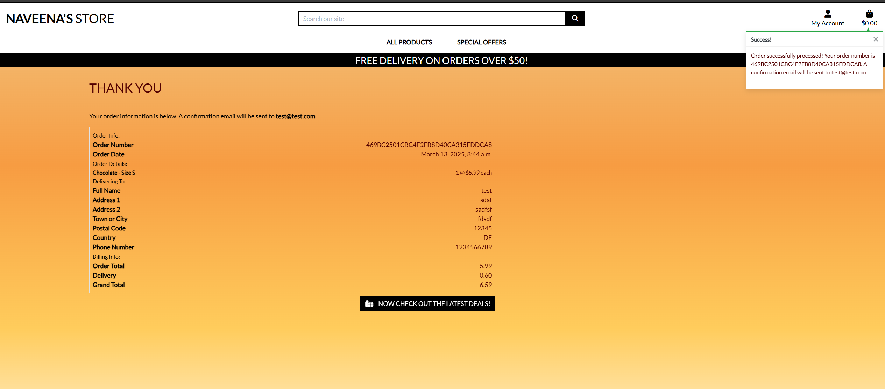

1. Save information option
   - Allows logged-in users to save delivery details to their profile for future use.
   - Offers non-authenticated users the option to sign up or log in to enable this feature.

2. Reusable templates
   - Modular templates for the form, order summary, and confirmation page ensure consistency and easy maintenance.

3. Interactive adjustments
   - Users can navigate back to the bag page to adjust quantities or remove items before finalizing the order.

#### Order Confirmation Email

- The checkout system includes an automatic confirmation email feature that provides customers with detailed information about their order.
- Upon successful payment, the system generates and sends a personalized email to the customer using the email address provided during checkout.

- The email includes key order details such as:
  - Order number
  - Order date
  - Total cost
  - Delivery address
  - Contact information
- The email reassures the customer that their order has been successfully processed.
- It offers clear instructions for reaching out with any questions or concerns.
- By delivering a professional and personalized confirmation email, the feature:
  - Enhances customer satisfaction
  - Builds trust in the brand
  - Provides an immediate record of the transaction

### Profile Page

The profile app provides users with a personalized area to manage their default delivery information, view their order history, and update personal details like name and email. This app ensures a streamlined and user-friendly experience for managing account information and past transactions.

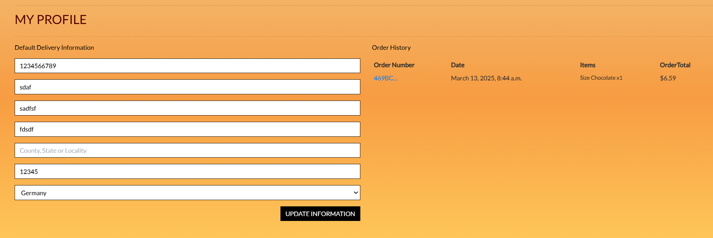

#### Backend Features

1. User Profile Model
   - Stores default delivery details such as:
     - Phone number
     - Address lines
     - Town or city
     - County
     - Postcode
     - Country
   - Links each profile to a User instance using a one-to-one relationship.
   - Automatically creates or updates the profile when a user is created using Django signals.

2. Order History Retrieval
   - Associates user profiles with their past orders, enabling users to view a detailed order history.
   - Provides detailed information about each order, including order number, date, items, and total cost.

3. Forms for User and Profile Updates
   - UserProfileForm for updating default delivery information with:
     - Custom placeholders and classes for consistency.
     - Focus on user-friendly design with a clean interface.
   - UserUpdateForm for updating personal details such as first name, last name, and email.

4. View Functions
   - profile: Displays the user's profile page, allowing updates to delivery information and personal details.
   - order_history: Provides detailed information about past orders, with a message confirming that the order has already been processed.

#### Frontend Features

1. Profile Page
   - Displays the user's personal details and default delivery information in a responsive, user-friendly layout.
   - Includes separate sections for:
     - Personal Information
     - Default Delivery Information
   - Features a single form for updating all information, submitted via a POST request.

2. Order History Table
   - Displays a list of the user's past orders in a table format with columns for:
     - Order number (clickable link for more details)
     - Order date (displayed using natural language)
     - Order items (including product name, size, and quantity)
     - Grand total
   - Responsive design ensures readability on all device sizes.

3. Order History Details
   - Provides a detailed breakdown of individual orders, including:
     - List of items ordered
     - Delivery address
     - Total costs, including delivery charges
     - Timestamp of the order date
   - Reuses the checkout success page template for consistency.

4. Form Design
   - All forms use the Crispy Forms library for a consistent and responsive design.
   - Custom placeholders and autofocus improve usability and guide users during input.

5. Error and Success Messaging
   - Displays clear feedback when forms are submitted:
     - Success messages confirm updates were saved successfully.
     - Error messages highlight validation issues or missing required fields.

### Add / Edit / Products Page

This project includes product management functionality that enables authorized users to efficiently add, edit, and delete products directly through the frontend interface.

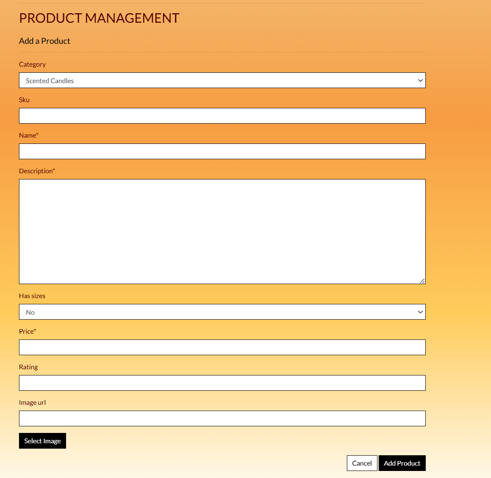

#### Add Product Functionality

The application includes a dedicated form and view for adding products:

- GET Request: The `add_product` view renders the `add_product.html` template with an empty `ProductForm` for entering product details.
- POST Request: When the form is submitted, the data is validated. If valid, the new product is saved to the database, and the user is redirected to the product detail page. If invalid, error messages guide the user to correct the issues.

The `add_product.html` template includes CSRF protection and uses Django's templating language for consistent rendering and security.

#### Edit Product Functionality

Editing existing products is handled by a similar process:

- GET Request: The `edit_product` view retrieves the product by its ID and pre-populates the `ProductForm` with the current data. The form is displayed in the `edit_product.html` template for user modifications.
- POST Request: On submission, the data is validated. If valid, the updates are saved, and the user is redirected to the product detail page. If invalid, error messages are displayed to assist the user.

The `edit_product.html` template is designed to mirror the add product page while displaying existing data for convenience.

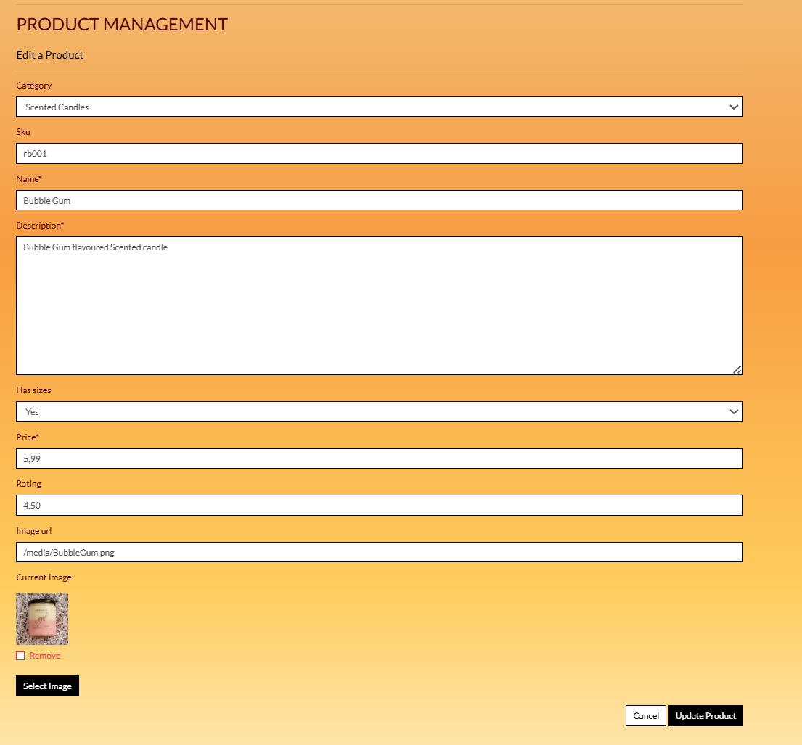

#### Delete Product Functionality

This functionality directly deletes the product without asking for any confirmation. I have to implemented a safe way of deletion.

#### Access Control

All product management views include safeguards to ensure only authorized users have access:

- The `@login_required` decorator restricts access to authenticated users.
- Additional checks confirm that only superusers can add, edit, or delete products.

These measures ensure secure and reliable product management, protecting the integrity of the catalog.

### Toast Messaging

Toast messages have been implemented throughout the project to provide feedback to users on various actions and processes. These messages appear dynamically to inform users of the success, error, warning, or informational status of their interactions. For example, toast messages are used when products are successfully added to the shopping bag, when users log in or sign up, and to notify them of any errors or confirmations in the checkout process.

The toast notifications are included in the project through the `includes/toasts` folder, using the `toast_error.html`, `toast_success.html`, `toast_warning.html`, and `toast_info.html` templates. These messages are displayed in a user-friendly format, improving the overall user experience by offering instant feedback without interrupting their flow on the page.

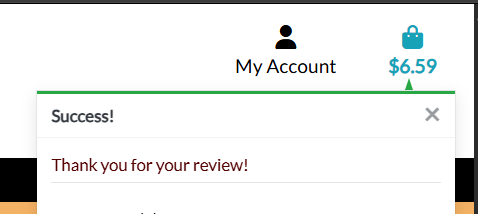

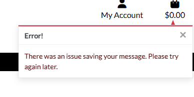

Each toast message is contextually relevant, ensuring that users understand the result of their actions, such as whether an operation was successful or if there was an error that needs addressing. The notifications are designed to be responsive, providing a consistent experience across all devices.

### About Us Page

The About Us page shares the story of Maison Lavaux and its founder, Antoine Lambert. It highlights his journey from Lavaux's vineyards to becoming a master perfumer in Paris, overcoming challenges and creating a brand known for its craftsmanship and sophistication.

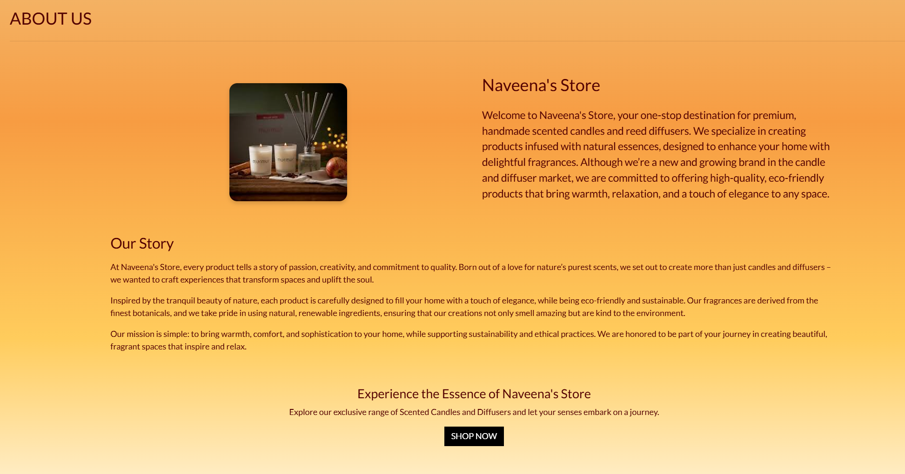

### Contact Page

The Contact Page allows users to reach out to Maison Lavaux for inquiries, support, or feedback, integrating seamlessly with the Contact app. This app includes both frontend and backend functionalities to manage user messages efficiently. By enabling clear communication, the Contact Page enhances customer support and ensures messages are tracked and addressed promptly, contributing to a seamless user experience.

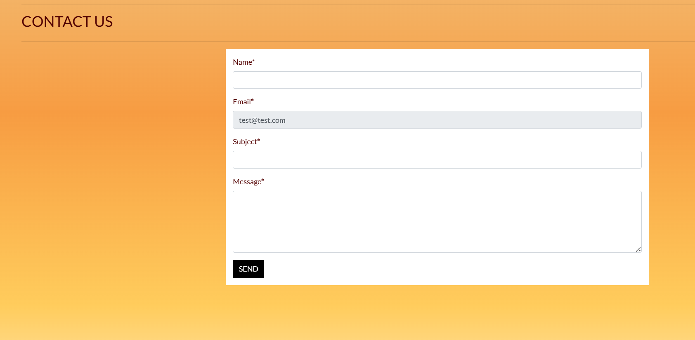

#### Key Features

- User-friendly form that allows users to submit their name, email, subject, and message.
- Pre-filled fields for registered users to simplify the process.
- Database integration to store submitted messages for tracking and follow-up.
- Admin notification via email for each new message to ensure timely responses.

  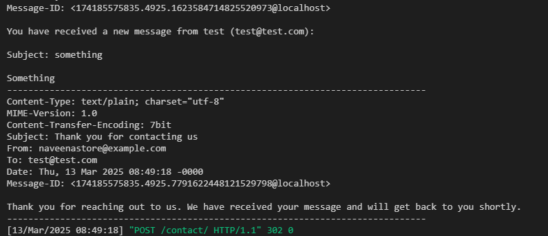

- Acknowledgment for users with a confirmation message and estimated response time.

#### Admin Features

- Admin panel management for viewing and resolving contact messages.
- Filters for resolved and replied statuses to streamline message handling.
- Search functionality to locate messages by name, email, subject, or content.

[Back to Table of Contents](#table-of-contents)

## Future-Features

To enhance the platform's functionality and user experience, the following features are planned for future development:

- Order Fulfillment Notifications: Automatically notify customers via email or SMS when their orders are fulfilled, improving communication and customer satisfaction. 
- Stock Management: Implement features to display stock available, handle low stock alerts, automated stock replenishment notifications, and better tracking of inventory levels for concurrent orders. 
- Wishlist Functionality: Allow users to save items to a wishlist for future purchase, encouraging customer retention and repeat visits. 
- Multi-Currency Support: Enable users to view product prices and complete purchases in their preferred currency, broadening the site's global appeal. 
- Enhanced Review System: Allow users to upload images with their reviews, offering more detailed feedback and enriching the shopping experience for future buyers.   
- Order Tracking System: Provide customers with real-time tracking of their orders, including shipment progress and expected delivery dates.  

[Back to Table of Contents](#table-of-contents)

## Known Bugs

- The home page background image to not displayed when the apllication is deployed to Heroku, also the image in about us page is not displayed. I tried to change the image url, checked the AWS S3, contacted the tutor support team but unfortunetly I am unable to fix the issue.

- While I submit the contact form, I am receiving error message, only while I try to submit in deployed version of my website. This works on my local environment. I am not sure if this has something to do with webhook. I tried trouble shooting using platforms such as chatgpt and perplexcity and other student from my batch also tred to help but I was not able to resolve it.

Receiving confirmation when submiting on my local environment.


Receiving this error when I submit my form.


- I am not completly satisfied with the outcome of my website since I wanted to implement more features due to time contraint. But I am happy I was able to come this far and would like to invest more time in future. Being pregnant was not easy with all sickness that I have. I would definetly make more advanced e-commerce website having this project as the base.

[Back to Table of Contents](#table-of-contents)

## Technologies Used
  - HTML
  - Python
  - CSS
  - JavaScript
  - Django used as the Python framework for the site
  - AWS S3 used for online static and media file storage
  - PostgresSQL used as the relational database management
  - Heroku used for hosting the site
  - GitHub for storing repository of development
  - GitPod used for cloud IDE
  - Balsamiq used for wireframing
  - Bootstrap 4 used for frontend framework
  - favicon.io used to make favicon for the site

### dependencies 

app | version
--- | ---
django-storages | 1.14.5
gunicorn | 23.0.0
jmespath | 1.0.1
oauthlib | 3.2.2
pillow | 10.3.0
psycopg2 | 2.9.10
PyJWT | 2.10.1
python3-openid | 3.2.0
pytz | 2025.1
requests-oauthlib | 2.0.0
s3transfer | 0.11.4
sqlparse | 0.5.3
stripe | 11.6.0

[Back to Table of Contents](#table-of-contents)


## Deployment
  This project was developed using GitPod. The web application is deployed on Heroku. All Static and media files are stored via Amazon AWS S3. The repository is hosted on GitHub.

[Goto Top](#Table of contents)

### Clone GitHub Repository

  By Cloning a GitHub repository you can create a local copy of a GitHub remote repository.
  Cloning is done via the following steps

  - 1. Login to GitHub
  - 2. Navigate to the main GitHub repository that you want to clone
  - 3. Click on the green dropdown button Code
  - 4. To clone the repository using HTTPS under HTTPS copy the link
  - 5. Open command prompt
  - 6. Change to the directory you want to create the repository in
  - 7. Type git clone and paste the URL you copied in step 4.
    ``` $ git clone https://github.com/your-username/your-repository```
  - 8. Press enter. Your local copy of the repository will be created

For this project GitPod IDE was used so I just had to create a workspace and connect to GitHub by choosing the repository.
Once the workspace opened in GitPod 

To install the dependencies from the command line in GitPod
pip3 install -r requirements.txt

Make migrations and setup initial database operations
on the CLI in GitPod enter python3 manage.py makemigrations
then
python3 manage.py migrate

To setup the categories and products copy over the media file and run
python3 manage.py loaddata categories
python3 manage.py loaddata products

Then I created a superuser by entering
python3 manage.py createsupreruser

### Deployment on Heroku

This project uses Heroku for production and static and media files are stored via a bucket on Amazon AWS S3. To deploy on Heroku

  - 1. Naviage to heroku.com and login and create new app for your project and set the region and click on create app.
  - 2. Connect Heroku app to github repository 
  - 3. Configure variables on Heroku by navigating to settings and click on Revela Config Vars 

Variable | Key
--- | ---
AWS_ACCESS_KEY_ID | Access key for AWS 
AWS_SECRET_ACCESS_KEY | secret key for AWS 
DATABASE_URL | database url got from code institute 
EMAIL_HOST_PASS | password for email sender 
EMAIL_HOST_USER | email address used 
PORT | 8000 
SECRET_KEY | Django secrey key 
STRIPE_PUBLIC_KEY | stripe public key 
STRIPE_SECRET_KEY | stripe secret key 
STRIPE_WH_SECRET | stripe webhook secret key 
USE_AWS | True 

  - 4. Then create a Procfile with contents - web: gunicorn naveena_store.wsgi:application

  - 5. add hostname of heroku app to allowed hosts in settings.py

  I have setup the debug to be true if the DEVELOPMENT is found in the environment variables which will be true for localhost.

  - 6. on Heroku under deploy for your app click Deploy Branch to deploy your app


### Amazon AWS S3

This project uses Amazon Web Servies (AWS https://aws.amazon.com/) to store static and media files.

Once youve created an AWS account and logged in. You can follow the following steps to setup your static and media files storage.

From the AWS Management Console.

  - Search for S3
  - Create a new bucket, give it a name matching your Heroku app name and choose a region closest to you
  - Uncheck Block all public access and acknowledge that the bucket will be public.
  - From Object ownership make sure ACLs are enabled and Bucket owner preferred is selected
  - From the Permisssions tab paste in the following CORS configuration

  ```
    [
  {
      "AllowedHeaders": [
          "Authorization"
      ],
      "AllowedMethods": [
          "GET"
      ],
      "AllowedOrigins": [
          "*"
      ],
      "ExposeHeaders": []
  }
]
  ```

  - Copy your ARN string
  - From the Bucket Policy tab, select the Policy Generator link and set
    - Policy type: S3 Bucket Policy
    - Effect: Allow
    - Principal *
    - Actions: GetObject()
    - Amazon Resource Name (ARN): paste your ARN here
    - Click add Statement
    - Click Generate Policy
    - Copy entire Policy and paste it into the Bucket Policy editor

    ```
    {
    "Version": "2012-10-17",
    "Id": "Policy1726973504037",
    "Statement": [
        {
            "Sid": "Stmt1726973489892",
            "Effect": "Allow",
            "Principal": "*",
            "Action": "s3:GetObject",
            "Resource": "arn:aws:s3:::bucket name/*"
        }
    ]
    }
    ```
    
    - Click save
    - From the Access Control List (ACL) section click edit and enable List for Everyone (public access) and accept the warning box.

### IAM
  Back on the AWS service menu, search for IAM (Identity and access management). Once on the IAM page

  - From User Groups click Create New Group
  - From User Groups, select newly created group and go to the permissions tab
  - Open the Add Permissions dropdown and click on Attach Policies
  - select the policy then click on Add Permissions at the bottom
  - From the JSON tab select Import Managed Policy link
    - Search for S3 select AmazonS3FullAccess policy and import
    
    ```
    {
    "Version": "2012-10-17",
    "Statement": [
        {
            "Sid": "Statement1",
            "Effect": "Allow",
            "Action": [
                "s3:*"
            ],
            "Resource": [
                "arn:aws:s3:::bucket name",
                "arn:aws:s3:::bucket name/*"
            ]
        }
    ]
    }
    ```

    - Click Review Policy
    - Provide a description a brief overview of what it for
    - Click Create Policy 

  - From User Groups click on group created
  - Click Attach Policy
  - Search for ther policy youve just created select it and click on Attach Policy
  - From User Groups click Add User
  - From Select AWS access type select Programmatic Access
  - Select the group to add to your user (created above)
  - Click Create User
  - under the User Summary on the right click on Create Access Key
    - set AWS_ACCESS_KEY_ID = Access Key ID
    - AWS_SECRET_ACCESS_KEY = Secret Access Key
  
### Final Setup
  - Back within S3 buckets create folder media
  - copy over existing media files to this folder
  - Under Manage Public Permisssions select Grant public read access to this object

[Back to Table of Contents](#table-of-contents)

## Credits

Being pregnant is not easy but I would like to thank Code Institute student care and the Tutoring team aswell as other students for their support throughout this course. I can not believe that the journey is come to an end. Being part of this course has made me achieve great height.

I have completly followed throught the PP5 walk through project to build my current project. I would like to explore more and learn, become more confident in building e-commerce project. I refered almost 20 student's project and readme file to build my own. 

I am not completly satisfied with the outcome of my website since I wanted to implement more features, but I am happy I was able to come this far and would like to invest more time in future. Being pregnant was not easy with all sickness that I have. I would definetly make more advanced e-commerce website having this project as the base.


** Thank you Code Institute

[Back to Table of Contents](#table-of-contents)


